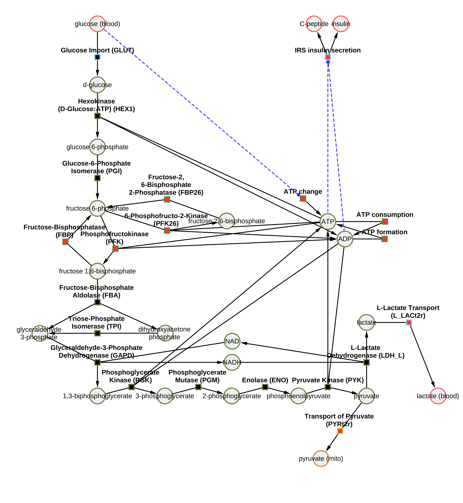

# Pancreas model
This repository provides the model of glucose-stimulated insulin secretion in the pancreatic β-cell.

The model is distributed as [SBML](http://sbml.org) available from [`pancreas_deepa.xml`](./models/pancreas_deepa.xml) with 
corresponding SBML4humans model report at [https://sbml4humans.de/model_url?url=https://raw.githubusercontent.com/matthiaskoenig/pancreas-model/main/models/pancreas_deepa.xml](https://sbml4humans.de/model_url?url=https://raw.githubusercontent.com/matthiaskoenig/pancreas-model/main/models/pancreas_deepa.xml)

## How to cite

> Deepa Maheshvare M. & König, Matthias. (2023). 
> *Model of glucose-stimulated insulin secretion in the pancreatic β-cell.*   
> Zenodo. [https://doi.org/10.5281/zenodo.7575803](https://doi.org/10.5281/zenodo.7575803)

## License

* Source Code: [LGPLv3](http://opensource.org/licenses/LGPL-3.0)
* Documentation: [CC BY-SA 4.0](http://creativecommons.org/licenses/by-sa/4.0/)
* Models: [CC BY-SA 4.0](http://creativecommons.org/licenses/by-sa/4.0/)

The pancreas-model source is released under both the GPL and LGPL licenses version 2 or
later. You may choose which license you choose to use the software under.

This program is free software: you can redistribute it and/or modify it under
the terms of the GNU General Public License or the GNU Lesser General Public
License as published by the Free Software Foundation, either version 2 of the
License, or (at your option) any later version.

This program is distributed in the hope that it will be useful, but WITHOUT ANY
WARRANTY; without even the implied warranty of MERCHANTABILITY or FITNESS FOR A
PARTICULAR PURPOSE. See the GNU General Public License for more details.

Funding
=======
Research of DM was supported by the Senior Research Fellowship from the Ministry of Human Resource Development (MHRD), Government of India. MK was supported by the Federal Ministry of Education and Research (BMBF, Germany) within the research network Systems Medicine of the Liver (LiSyM, grant number 031L0054) and by the German Research Foundation (DFG) within the Research Unit Program FOR 5151 "[QuaLiPerF](https://qualiperf.de) (Quantifying Liver Perfusion-Function Relationship in Complex Resection - A Systems Medicine Approach)" by grant number 436883643 and grant number 465194077 (Priority Programme SPP 2311, Subproject SimLivA).

© 2021-2023 Deepa Maheshvare M. & Matthias König, [Systems Medicine of the Liver](https://livermetabolism.com)
